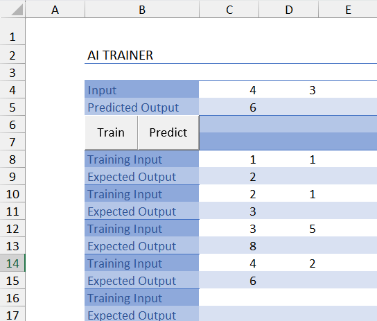

# CloudTechnologiesProject

## Short Description

CloudTechnologiesProject is a powerful tool that allows users to train AI models without needing to know how to code, using Microsoft Excel as a frontend. By leveraging VBA macros, this project provides an intuitive interface within Excel, enabling users to easily integrate and enhance cloud-based technologies for their data processing and analysis tasks.

## Contributors

| 🧑‍💻 Name | 😺 GitHub | Self Reports |
| - | - | - |
| Donato Martín | [](https://github.com/dononitram) | [](https://github.com/dononitram/CloudTechnologiesProject/wiki/Self-Reports#donato) |
| Nadir Mutallimov | [](https://github.com/mutikn) | [](https://github.com/dononitram/CloudTechnologiesProject/wiki/Self-Reports#nadir) |
| Baizhan Dossanov | [](https://github.com/Baizhan17) | [](https://github.com/dononitram/CloudTechnologiesProject/wiki/Self-Reports#baizhan) |
| Mohamed Bouguezine | [](https://github.com/mohBgz) | [](https://github.com/dononitram/CloudTechnologiesProject/wiki/Self-Reports#mohamed) |
| Eldar Zeynalli | [](https://github.com/eldarzeynalli) | [](https://github.com/dononitram/CloudTechnologiesProject/wiki/Self-Reports#eldar) |
| Nariman Aliyev | [](https://github.com/Nariman18) | [](https://github.com/dononitram/CloudTechnologiesProject/wiki/Self-Reports#Nariman18) |


## Installation and How To Use

0. Clone the repository

```sh
git clone https://github.com/dononitram/CloudTechnologiesProject
```

1. First install the necessary python dependencies:

```sh
pip install -r requirements.txt
```

2. After that run the server:

```sh
python src/backend/main.py
```

3. Once the server is running open the frontend spreadsheet located in the src/frontend/excel directory (open source under development).

4. Place the training data in the training area (8C Cell onwards horizontally and vertically) in the following way.

```
Training Input
Expected Output
Training Input
Expected Output
...
```

5. Hit Train

6. Place your input in the prediction area (Rows 4 and 5 from the column 4 onwards).

7. Hit Predict

### Example: Teaching the Model Simple Addition

Witness the magic of AI by teaching the model to perform simple addition of two parameters. Remember, the relationship between inputs and outputs isn't strictly 2:1; it can be n:n where n ≥ 1. 



## Documentation

Dive into our comprehensive [📄 documentation](docs/Documentation.md) to unlock the full potential of CloudTechnologiesProject.

## Licensing
This project is licensed under the Creative Commons Attribution-NonCommercial-NoDerivatives 4.0 International License. See the [LICENSE.txt](LICENSE.txt) file for details.

## Excel Dependency Notice
This project includes VBA macros for use with Microsoft Excel. Microsoft Excel is proprietary software and is not covered under this license. Users must obtain their own licensed copy of Excel.

## Disclaimer
This project is an independent tool developed by [Your Name/Organization]. It is not affiliated with, endorsed by, or sponsored by Microsoft Corporation.

This tool requires **Microsoft Excel** to function. Users must have a valid license to Microsoft Excel to use this tool. Microsoft Excel is a registered trademark of Microsoft Corporation.
