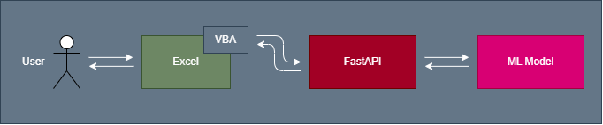
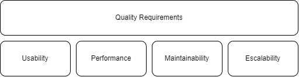

# Documentation

# 1. Introduction and Goals

This document follows the arc42 standard for software architecture documentation. The arc42 template provides a structured approach to capturing and communicating architectural decisions, design, and rationale.

## 1.1. Requirements Overview

The main goal of this project is to develop a system that integrates cloud services, machine learning models, and Excel functionalities for enhanced productivity and ease of use. The application must have the following functionalities:

- A cloud-hosted backend that manages data and handles user requests efficiently.
- A machine learning service to provide accurate predictions based on user inputs.
- An API integration for seamless communication between the backend, Excel, and the ML service.
- A user-friendly Excel interface to input data and display prediction results.
- A secure and scalable infrastructure to support multiple users and large datasets.

## 1.2. Quality Goals
| **Quality Goal**    | **Motivation**                                                                                                                           |
|---------------------|-----------------------------------------------------------------------------------------------------------------------------------------|
| **Efficiency**      | The system must process requests quickly and reliably to ensure a seamless user experience, especially for tasks involving Excel automation or predictions. |
| **Usability**       | The application must be intuitive and user-friendly to ensure that both non-technical users (working with Excel) and technical users can operate it easily. |
| **Maintainability** | The codebase should be clean and modular to allow for easy updates, including adding new machine learning models or changing integration endpoints. |
| **Scalability**     | The solution should handle increased usage, especially for larger datasets or multiple concurrent users accessing the machine learning services. |
| **Security**        | The application must protect sensitive data, including predictions and user inputs, while preventing unauthorized access to the system and its infrastructure. |

## 1.3. Stakeholders

| **Team**                  | **Name**                                   | **Expectations**                                                   |
|---------------------------|-------------------------------------------|-------------------------------------------------------------------|
| **Cloud Infrastructure Team** | • Donato Martín                        |  Build and maintain a secure and scalable cloud infrastructure.    |
|                           | • Adilet Dzhuraev                         |                                                                   |
|                           | • Nadir Mutallimov                        |                                                                   |
|                           | • Oğuzhan Demir                           |                                                                   |
|                           |                           |                                                                   |
| **Python Team**           | • Álvaro Tébar                            | Develop and integrate APIs and machine learning solutions.        |
|                           | • Baizhan Dossanov                        |                                                                   |
|                           | • Mohamed Bouguezine                      |                                                                   |
|                           | • Dashqin Mammadov                        |                                                                   |
|                           | • Mohammed Kadri                          |                                                                   |
|                           |                           |                                                                   |
| **Excel Integration Team** | • Marshal Tawanda Dhliwayo               | Automate and integrate Excel workflows with backend systems.      |
|                           | • Rusif Safarov                           |                                                                   |
|                           | • Ismail Talha Yanik                      |                                                                   |
|                           | • Eldar Zeynalli                          |                                                                   |
|                           | • Azad Azizade                            |                                                                   |

# 2. Constraints

## 2.1. Technical Constraints

| Constraint | Explanation |
| - | - |
| Oracle Cloud Infrastructure Hosting Solution | Oracle Cloud is used to host the project, providing scalability, security, and performance for the infrastructure.|
| Python Backend | The backend is developed in Python to handle API logic, data processing, and communication with machine learning services.|
| Python Machine Learning Service | Machine learning models are implemented to analyze data and provide predictions, such as in the Excel integration workflows.|
| Visual Basic Application in Excel |VBA in Excel is used to automate workflows, integrate with APIs, and streamline repetitive tasks for users. |

## 2.2. Organizational Constraints

| Constraint | Explanation |
| - | - |
| Team | Our team is divided into three sub-teams: Cloud Infrastructure, Python Development, and Excel Integration. Each team focuses on its specific domain for efficiency.|
| Time |  Deadline at the end of the semester, the time is divided among two hours per week of in-class work. We schedule multiple online meetings to catch up, give feedback, and set goals.|
| Tech Proficiency |Some members are still new to certain tools and technologies like Oracle Cloud and Python machine learning, necessitating a learning phase. |

## 2.3. Convention Constraints

| Constraint | Explanation |
| - | - |
| Clean Code | The code composing the application must prioritize clarity and cleanliness, facilitating comprehension and ease of maintenance in the long term. We adhere to camelCase for JavaScript and PascalCase for React, ensuring clear and descriptive names while steering clear of confusing prefixes. We need to adhere to the conventions of the programming languages we’re using, including JavaScript , HTML and CSS. |
| Arc42 | The project utilizes [Arc42](https://arc42.org/) for documentation purposes. |
| Usability | The application must be user-friendly, with a clean and intuitive interface that is easy to navigate. The user experience should be seamless and engaging, with a focus on accessibility and adaptability. So, to achieve this, we should use tools like Google LightHouse to measure the performance of the application. |

# 3. Context and Scope

## 3.1. Business Context

## 3.2  Technical Context

**Technical Context diagram**

| **Communication Partners** | **Inputs**                                                                                     | **Outputs**                                                 |
|-----------------------------|-----------------------------------------------------------------------------------------------|------------------------------------------------------------|
| **Users**                  | Inputs data through the Excel interface or API, providing parameters for predictions.         | Receives predictions and results based on their inputs.    |
| **Backend API**            | Processes requests from Excel or users, such as retrieving predictions or submitting training data to the ML service. | Returns processed data, predictions, or training results to users. |
| **Machine Learning Service** | Receives parameters or datasets for training and prediction from the backend.                | Outputs predictions, analysis results, or updates the ML model based on training. |
| **Cloud Infrastructure**   | Hosts the backend and machine learning service, handling all computational tasks securely.     | Ensures secure storage, efficient processing, and scalability of training and prediction workflows. |

# 4. Solution Strategy

## **4.1. Technology Decisions**

In order to develop an application that meets the expected quality criteria, we have decided to use the following technologies, as they were the one given to us in the base project:

- **Python**: Main programming language used for both backend and machine learning service development.
- **FastAPI**: A high-performance web framework used to build the backend API for handling user requests and predictions.
- **Scikit-learn**: Python library used for implementing machine learning models and handling predictions and training.
- **Oracle Cloud**: Used to host the backend and machine learning services, ensuring scalability and availability.
- **Excel VBA (Visual Basic for Applications)**: Provides user interaction with the system through an Excel-based interface for input and prediction outputs.
- **GitHub**: Used for version control, collaboration, and as a platform for managing the project repository.

## **4.2. Top-level Decomposition**

We have decided to implement a modular architecture, with different components for distinct purposes. For instance, we currently have the following modules:

- **User Input Module**: Handles user input and forwards it to the backend for processing and predictions.
- **Prediction Module**: Processes the input data using machine learning models to generate predictions.
- **Training Module**: Allows the system to train or update machine learning models based on new data.
- **Data Storage Module**: Manages the storage of user inputs, prediction results, and training data in the cloud.
- **Excel Interface Module**: Provides an Excel-based interface for users to interact with the system, submit inputs, and view predictions.
- **Cloud Hosting Module**: Ensures scalability, availability, and hosting of the backend and ML services.

## **4.3. Decisions Taken to Achieve Quality Goals**

| **Quality Goal**                  | **Decision Made**                                                                                                                                                                                                                                                                           |
|------------------------------------|----------------------------------------------------------------------------------------------------------------------------------------------------------------------------------------------------------------------------------------------------------------------------------------------|
| **Usability**                     | The application must be easy to use and accessible. This includes designing an intuitive Excel-based interface for users to interact with the system and providing clear documentation.                                                                                                        |
| **Performance**                   | To optimize performance, we are hosting the system on Oracle Cloud to ensure reliable and scalable infrastructure. The backend will efficiently handle requests and balance the load across services to minimize response times.                                                               |
| **Maintainability and Scalability** | The application is built using modular architecture to ensure ease of updates and scalability. Design patterns such as the Single Responsibility Pattern are applied to keep each module focused and maintainable. Additionally, cloud infrastructure supports scaling for increasing user demands. |

## **4.4. Organizational Decisions**

We have taken the following organizational decisions:

- **Tasks**: We have decided to distribute the tasks equally among team members to ensure a balanced workload. Each completed task will be reviewed by at least 50% of the team for validation.

- **GitHub Issues**: We will use GitHub Issues to create and assign tasks. This tool will also be used to discuss and resolve critical decisions related to the project.

- **Language**: The project, including code and documentation, will be developed in English to ensure accessibility for everyone.

- **External Meetings**: Regular meetings will be scheduled to discuss the project’s progress and decide on the next steps.

- **Internal Communication**: Discord will be our primary communication platform for project discussions and issue resolutions. GitHub Webhooks will be configured to notify the team of repository changes.

- **Documentation**: The project utilizes **Arc42** for documentation purposes, providing a structured approach to describing the project's architecture and processes.

# 5. Building Block View

# 6. Runtime View

# 7. Deployment View

# 8. Cross-Cutting Concepts

# 9. Architecture Decisions

The architecture decisions can be found in the Github Wiki: [Wiki ADRS](https://github.com/dononitram/CloudTechnologiesProject/wiki/ADRS)

# 10. Quality Requirements

## 10.2. Quality Scenarios

### 10.2.1. Usage scenarios

#### Privacy
| **Usage Scenario**                                                                 | **System Response**                                                                                                                                                           |
|-----------------------------------------------------------------------------------|-----------------------------------------------------------------------------------------------------------------------------------------------------------------------------|
| The user accesses the application and logs in using their credentials.            | The system validates the user’s credentials, and if they are correct, the user is redirected to the main interface. If not, an error message is displayed, requesting re-entry.|

#### Performance

| **Usage Scenario**                                                                                     | **System Response**                                                                                                                                               |
|-------------------------------------------------------------------------------------------------------|-----------------------------------------------------------------------------------------------------------------------------------------------------------------|
| The user uploads a dataset for prediction analysis through the interface.                             | The system efficiently processes the uploaded data, sends it to the backend API for analysis, and retrieves results promptly for display.                       |

#### Usability
| **Usage Scenario**                                                                                         | **System Response**                                                                                                                        |
|-----------------------------------------------------------------------------------------------------------|------------------------------------------------------------------------------------------------------------------------------------------|
| A new user accesses the application and interacts with the interface to understand its features.           | The user is guided through an intuitive design that clearly explains the options and functionalities, making it easy for them to navigate and use the application. |

### 10.2.2 Change Scenarios
#### Maintainability and Scalability
| **Change Scenario**                                  | **System Response**                                                                                                                           |
|-----------------------------------------------------|---------------------------------------------------------------------------------------------------------------------------------------------|
| Add new prediction model                            | When a new prediction model is added to the system, existing functionalities should remain unaffected and continue to work as intended.       |
| Integrate alternative login methods                 | When new login methods (e.g., OAuth, Google login) are added, existing login options should remain functional and seamlessly integrated.      |
| Implement system hotfixes                           | Critical errors or bugs should be resolved and deployed in real-time without disrupting the user experience or requiring extended downtime.   |

# 11. Risks and Technical Debt

The technical risks and technical debts section of the document provides an overview of potential challenges and issues that may arise during the development and maintenance of the project. These risks and debts need to be carefully considered and addressed to ensure the successful completion and long-term viability of the project. The following subsections outline the internal and external technical risks, as well as the technical debts that should be taken into account.

## **11.1. Technical Risks**

We consider a technical risk a potential event that can threaten the successful completion of the project, delay timelines, increase costs, or even lead to project failure if not properly managed. The following subsections outline the internal and external technical risks that have been identified for the project.

### 11.1.1. Internal
| **Description**                    | **Priority** | **Considerations**                                                                 |
|------------------------------------|--------------|-------------------------------------------------------------------------------------|
| Poor knowledge of tools and project | 8            | Creates extra research tasks and delays; requires quick familiarization to proceed. |
| Limited expertise in new tech       | 7            | May miss opportunities for innovation; consider training sessions to bridge gaps.   |
| Dependency on external APIs         | 6            | Risk of API downtime or changes; ensure fallback mechanisms and frequent monitoring.|
| Unequal effort distribution         | 4            | Leads to delays; ensure balanced task allocation and communication.                 |

### 11.1.2. External

| **Description**        | **Priority** | **Considerations**                                                                                     |
|-------------------------|--------------|---------------------------------------------------------------------------------------------------------|
| Oracle Cloud Failure    | 8            | Reliance on Oracle Cloud for hosting; downtime could result in service interruptions and impact user access. |
| FastAPI Service Failure | 3            | In case of a FastAPI failure, user requests and operations would be temporarily unavailable until the issue is resolved. |

## 11.2. Technical debts

| **Description**                   | **Priority** | **Considerations**                                                                                                                                                     |
|-----------------------------------|--------------|-----------------------------------------------------------------------------------------------------------------------------------------------------------------------|
| Limited scalability of cloud services | 8            | The cloud-based infrastructure may not handle significant traffic increases due to the lack of proper scalability measures. Implementing load testing, monitoring, and auto-scaling is essential to ensure the system can handle future growth. |
| Code quality issues               | 5            | The Python backend might have code smells, duplication, or insufficient documentation. Regular code reviews, refactoring, and thorough documentation updates are critical to maintain clean and extendable code. |
| Inadequate security measures      | 4            | The current security practices may not fully mitigate risks such as unauthorized data access or API abuse. Security audits and implementing techniques like input validation and encryption are necessary. |
| Lack of internationalization      | 6            | The application does not currently support multiple languages, limiting usability for non-English-speaking users. Implementing internationalization would make the app more inclusive. |
| Optional features                 | 8            | Some optional features, like advanced prediction reports or detailed analytics, have not been implemented, which may limit the user experience. |

# 12. Glossary

# 13. References

# 13. Legend